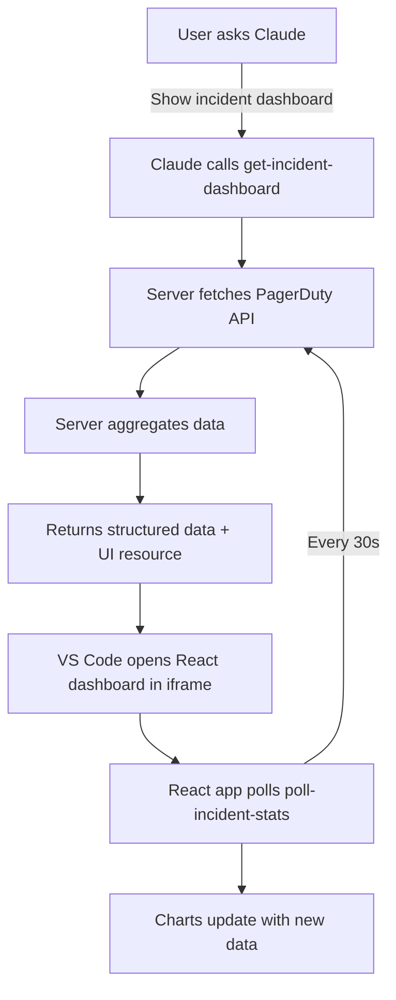

# MCP Apps Implementation Guide

Complete guide for implementing the PagerDuty MCP Visualization Server with VS Code integration.

## Table of Contents

1. [Overview](#overview)
2. [Prerequisites](#prerequisites)
3. [Architecture](#architecture)
4. [Step-by-Step Installation](#step-by-step-installation)
5. [VS Code Configuration](#vs-code-configuration)
6. [Project Structure](#project-structure)
7. [Development Workflow](#development-workflow)
8. [Technical Implementation](#technical-implementation)
9. [Troubleshooting](#troubleshooting)

---

## Overview

The PagerDuty MCP Visualization Server adds an interactive dashboard layer to the PagerDuty MCP Server using the [MCP Apps SDK](https://github.com/modelcontextprotocol/ext-apps). It provides real-time incident visualization directly in VS Code's Claude Chat interface.

### Key Features

- 📊 **Incident Timeline Chart** - Live trends over 24h/7d/30d with triggered/acknowledged/resolved breakdown
- 🎯 **Service Health Table** - Top 10 services by incident count with status indicators (critical/warning/healthy)
- 📈 **Urgency Distribution** - Donut chart showing high vs low urgency percentages
- ⏱️ **MTTR Analytics** - Average resolution time per service
- 🔄 **Real-time Updates** - Auto-refresh every 30 seconds with pause/resume controls
- 📱 **Active Incidents Feed** - Live stream of current incidents with status badges

---

## Prerequisites

### Required Software

1. **Node.js**: v20.11.0+ or v22+ (required for `import.meta.filename` support)
   ```bash
   # Check version
   node --version
   
   # If using nvm
   nvm use 22
   # or
   nvm install 22
   ```

2. **Bun runtime**: Auto-installed during build, but can be pre-installed:
   ```bash
   curl -fsSL https://bun.sh/install | bash
   export PATH="$HOME/.bun/bin:$PATH"
   ```

3. **VS Code**: Latest version with Claude/Copilot extension

4. **PagerDuty API Credentials**:
   - User API Token (read-only access sufficient)
   - Your PagerDuty email address

### Directory Structure

This guide assumes the following structure:
```
pagerduty-mcp-server/
├── pagerduty_mcp/          # Python MCP server (main)
├── mcp-apps/               # Visualization layer (this guide)
│   ├── dist/              # Build output
│   ├── lib/               # TypeScript utilities
│   ├── src/               # React components
│   ├── server.ts          # MCP server logic
│   ├── main.ts            # HTTP server for dev
│   ├── package.json       # Dependencies
│   ├── vite.config.ts     # Build config
│   └── .vscode/           # VS Code settings
└── README.md
```

---

## Architecture

### Two-Tool Pattern (MCP Apps Standard)

The server follows the official MCP Apps two-tool pattern:



### Tools

1. **`get-incident-dashboard`** (Model-facing)
   - Called by LLM when user requests visualization
   - Fetches incident data from PagerDuty API
   - Aggregates time-series, service health, MTTR
   - Returns structured JSON + opens React UI
   - Provides text summary for LLM context

2. **`poll-incident-stats`** (App-only)
   - Called by React app every 30 seconds
   - Returns lightweight real-time metrics
   - Hidden from LLM via `_meta.ui.visibility: ["app"]`
   - Only dynamic data, no full refetch

### Data Flow

```typescript
// 1. Tool registration (server.ts)
registerAppTool(server, "get-incident-dashboard", {
  _meta: { ui: { resourceUri: "ui://incident-dashboard/mcp-app.html" } },
  // ...
});

// 2. React app initialization (mcp-app.tsx)
const { app } = useApp({ /* ... */ });
app.ontoolresult = (result) => {
  setDashboardData(result.structuredContent);
};

// 3. Polling for updates (mcp-app.tsx)
setInterval(() => {
  app.callServerTool({ name: "poll-incident-stats" });
}, 30000);
```

### Tech Stack

- **Backend**: TypeScript, Node.js, MCP SDK
- **Frontend**: React 19, Chart.js 4.4
- **Build Tools**: Vite (UI), Bun (server), TypeScript
- **MCP SDK**: `@modelcontextprotocol/ext-apps`
- **Validation**: Zod schemas for type safety

---

## Step-by-Step Installation

### 1. Navigate to MCP Apps Directory

```bash
cd /Users/svillanelo/Documents/GitHub/pagerduty-mcp-server/mcp-apps
```

### 2. Install Dependencies

```bash
npm install
```

This will install:
- `@modelcontextprotocol/ext-apps` - MCP Apps SDK
- `@modelcontextprotocol/sdk` - Core MCP protocol
- `react` + `react-dom` - UI framework
- `chart.js` - Charting library
- `express` + `cors` - Development server
- `zod` - Schema validation
- Build tools: `vite`, `typescript`, `bun`, etc.

### 3. Build the Project

```bash
npm run build
```

This command runs a multi-stage build:

```bash
# 1. TypeScript type checking (no emit)
tsc --noEmit

# 2. Vite build: React app → single HTML file
INPUT=mcp-app.html vite build

# 3. Server compilation: server.ts → dist/server.js
tsc -p tsconfig.server.json
bun build server.ts --outdir dist --target node

# 4. CLI entry point: main.ts → dist/index.js with shebang
bun build main.ts --outfile dist/index.js --target node --external "./server.js" --banner "#!/usr/bin/env node"
```

**Output:**
```
dist/
├── mcp-app.html       # Single-file React app (~759KB)
├── server.js          # MCP server logic
├── index.js           # CLI entry point (with #!/usr/bin/env node)
└── *.d.ts            # TypeScript declarations
```

### 4. Verify Build

```bash
ls -lh dist/

# Expected output:
# -rw-r--r--  1 user  staff   759K  mcp-app.html
# -rwxr-xr-x  1 user  staff    45K  index.js
# -rw-r--r--  1 user  staff   120K  server.js
```

### 5. Set Environment Variables

```bash
# In your shell profile (~/.zshrc, ~/.bashrc)
export PAGERDUTY_API_KEY="your-api-key-here"
export PAGERDUTY_USER_EMAIL="your-email@pagerduty.com"

# Or create .env file (for development only)
echo 'PAGERDUTY_API_KEY=your-key' >> .env
echo 'PAGERDUTY_USER_EMAIL=your-email' >> .env
```

⚠️ **Security Note**: Never commit `.env` files to git. The workspace `.vscode/settings.json` uses `${env:PAGERDUTY_API_KEY}` to read from environment variables.

---

## VS Code Configuration

### Workspace Settings (Current Setup)

File: `mcp-apps/.vscode/settings.json`

```json
{
  "claude.mcpServers": {
    "pagerduty-viz": {
      "command": "/Users/svillanelo/.nvm/versions/node/v22.22.0/bin/node",
      "args": [
        "/Users/svillanelo/Documents/GitHub/pagerduty-mcp-server/mcp-apps/dist/index.js",
        "--stdio"
      ],
      "env": {
        "PAGERDUTY_API_KEY": "${env:PAGERDUTY_API_KEY}",
        "PAGERDUTY_USER_EMAIL": "svillanelo@pagerduty.com"
      }
    }
  }
}
```

### Configuration Breakdown

| Setting | Value | Notes |
|---------|-------|-------|
| **Server Name** | `pagerduty-viz` | Identifier for the MCP server |
| **Command** | `/Users/svillanelo/.nvm/versions/node/v22.22.0/bin/node` | **Full path to Node.js binary** (v22.22.0 via nvm) |
| **Args** | `["dist/index.js", "--stdio"]` | **Full path to built server** + stdio transport |
| **Environment** | `PAGERDUTY_API_KEY`, `PAGERDUTY_USER_EMAIL` | Credentials (API key from env var) |

### Important Notes

1. **Node.js Path**: Must be absolute path to Node v20.11+ or v22+
   - If using nvm: `which node` to find path
   - If using system Node: `/usr/local/bin/node`

2. **Index.js Path**: Must be absolute path to built server
   - Workspace-relative: `/path/to/mcp-apps/dist/index.js`
   
3. **Environment Variables**: 
   - `${env:PAGERDUTY_API_KEY}` reads from shell environment
   - Alternative: Hardcode key (less secure) or use VS Code input prompts

### Alternative: Global User Settings

For availability across all workspaces:

**File**: `~/Library/Application Support/Code/User/settings.json` (macOS)

```json
{
  "mcp": {
    "inputs": [
      {
        "type": "promptString",
        "id": "pagerduty-api-key",
        "description": "PagerDuty API Key",
        "password": true
      }
    ],
    "servers": {
      "pagerduty-viz": {
        "type": "stdio",
        "command": "/Users/svillanelo/.nvm/versions/node/v22.22.0/bin/node",
        "args": [
          "/Users/svillanelo/Documents/GitHub/pagerduty-mcp-server/mcp-apps/dist/index.js",
          "--stdio"
        ],
        "env": {
          "PAGERDUTY_API_KEY": "${input:pagerduty-api-key}",
          "PAGERDUTY_USER_EMAIL": "svillanelo@pagerduty.com"
        }
      }
    }
  }
}
```

This uses VS Code's secure input prompt for the API key.

---

## Project Structure

### TypeScript Configuration

#### `tsconfig.json` (UI Build)

```jsonc
{
  "compilerOptions": {
    "target": "ESNext",              // Modern JavaScript
    "lib": ["ESNext", "DOM", "DOM.Iterable"],
    "module": "ESNext",
    "moduleResolution": "bundler",   // Vite bundler mode
    "allowImportingTsExtensions": true,
    "resolveJsonModule": true,
    "isolatedModules": true,
    "verbatimModuleSyntax": true,
    "noEmit": true,                  // Vite handles build
    "jsx": "react-jsx",              // React 19 automatic JSX
    "strict": true,
    "skipLibCheck": true,
    "noUnusedLocals": true,
    "noUnusedParameters": true,
    "noFallthroughCasesInSwitch": true
  },
  "include": ["src", "server.ts"]
}
```

#### `tsconfig.server.json` (Server Build)

Separate config for Node.js server compilation (referenced in build script).

### Vite Configuration

File: `vite.config.ts`

```typescript
import { defineConfig } from "vite";
import react from "@vitejs/plugin-react";
import { viteSingleFile } from "vite-plugin-singlefile";

const INPUT = process.env.INPUT;  // mcp-app.html or simple-dashboard.html
if (!INPUT) {
  throw new Error("INPUT environment variable is not set");
}

const isDevelopment = process.env.NODE_ENV === "development";

export default defineConfig({
  plugins: [
    react(),                // React JSX transform
    viteSingleFile()        // Bundle everything into single HTML file
  ],
  build: {
    sourcemap: isDevelopment ? "inline" : undefined,
    cssMinify: !isDevelopment,
    minify: !isDevelopment,
    rollupOptions: {
      input: INPUT,         // Dynamic entry point
    },
    outDir: "dist",
    emptyOutDir: false,     // Don't delete server.js
  },
});
```

**Key Features**:
- **Single-file output**: `vite-plugin-singlefile` inlines all CSS/JS into HTML
- **Dynamic input**: `INPUT` env var switches between dashboards
- **Preserves server files**: `emptyOutDir: false` keeps `server.js`

### Package.json Scripts

```json
{
  "scripts": {
    "build": "tsc --noEmit && cross-env INPUT=mcp-app.html vite build && tsc -p tsconfig.server.json && bun build server.ts --outdir dist --target node && bun build main.ts --outfile dist/index.js --target node --external \"./server.js\" --banner \"#!/usr/bin/env node\"",
    "build:simple": "cross-env INPUT=simple-dashboard.html vite build",
    "watch": "cross-env INPUT=mcp-app.html vite build --watch",
    "watch:simple": "cross-env INPUT=simple-dashboard.html vite build --watch",
    "serve": "bun --watch main.ts",
    "start": "cross-env NODE_ENV=development npm run build && npm run serve",
    "dev": "cross-env NODE_ENV=development concurrently 'npm run watch' 'npm run serve'",
    "dev:simple": "cross-env NODE_ENV=development concurrently 'npm run watch:simple' 'npm run serve'",
    "prepublishOnly": "npm run build"
  }
}
```

**Usage Examples**:

```bash
# Production build
npm run build

# Development with hot reload
npm run dev

# Watch UI changes only
npm run watch

# Serve development server
npm run serve
```

### File Breakdown

```
mcp-apps/
├── dist/                      # Build output (generated)
│   ├── mcp-app.html          # Single-file React dashboard
│   ├── index.js              # CLI entry with shebang
│   └── server.js             # MCP server implementation
│
├── lib/                       # Shared TypeScript utilities
│   ├── aggregations.ts       # Time-series bucketing, MTTR calculation
│   ├── cache.ts              # TTL cache for API responses
│   ├── pagerduty-client.ts   # PagerDuty REST API wrapper
│   └── schemas.ts            # Zod schemas + TypeScript types
│
├── src/                       # React UI source
│   ├── mcp-app.tsx           # Main dashboard component
│   ├── global.css            # Global styles
│   └── components/           # Reusable React components
│
├── server.ts                  # MCP server (tool registration)
├── main.ts                    # HTTP server for development
├── mcp-app.html              # HTML template for UI
├── package.json              # Dependencies and scripts
├── tsconfig.json             # TypeScript config (UI)
├── tsconfig.server.json      # TypeScript config (server)
├── vite.config.ts            # Vite build config
└── .vscode/
    └── settings.json         # VS Code MCP server config
```

---

## Development Workflow

### Initial Setup

1. **Clone and install**:
   ```bash
   cd mcp-apps
   npm install
   ```

2. **Build once**:
   ```bash
   npm run build
   ```

3. **Configure VS Code**: See [VS Code Configuration](#vs-code-configuration)

4. **Restart VS Code**:
   - `Cmd+Shift+P` → "Developer: Reload Window"
   - Or fully quit and reopen VS Code

### Development Mode

Run with hot reload:

```bash
npm run dev
```

This starts two processes concurrently:
1. **Vite watch**: Rebuilds `mcp-app.html` on file changes
2. **Bun serve**: Runs HTTP server with auto-restart

**Output**:
```
[0] vite v6.0.0 building for production...
[1] HTTP server running at http://localhost:3000
[1] Watching for changes...
```

Open http://localhost:3000 to test the dashboard standalone.

### Making Changes

#### UI Changes (React/CSS)

1. Edit files in `src/`:
   ```bash
   # Example: Modify dashboard component
   code src/mcp-app.tsx
   ```

2. Watch mode auto-rebuilds:
   ```bash
   npm run watch
   ```

3. Restart VS Code MCP server:
   - `Cmd+Shift+P` → "MCP: List Servers"
   - Click restart icon for `pagerduty-viz`

#### Server Changes (Tools/API)

1. Edit `server.ts` or files in `lib/`:
   ```bash
   code server.ts
   code lib/pagerduty-client.ts
   ```

2. Rebuild server:
   ```bash
   npm run build
   ```

3. Restart MCP server in VS Code (same as above)

### Testing in VS Code

1. **Open Chat Panel**: `Cmd+I` (Mac) or `Ctrl+I` (Windows/Linux)

2. **Enable MCP Tools**: Click 🛠️ icon in chat

3. **Verify server running**:
   - `Cmd+Shift+P` → "MCP: List Servers"
   - Look for `pagerduty-viz` with green status

4. **Test commands**:
   ```
   Show me incident trends
   Get incident dashboard for last 7 days
   What's the service health status?
   ```

5. **Check for errors**:
   - View → Output → Select "MCP" from dropdown
   - Look for server logs and errors

---

## Technical Implementation

### MCP Server Registration

File: `server.ts`

```typescript
import { registerAppTool, registerAppResource } from "@modelcontextprotocol/ext-apps";

const resourceUri = "ui://incident-dashboard/mcp-app.html";

// Register the visualization tool
registerAppTool(server, "get-incident-dashboard", {
  _meta: {
    ui: {
      resourceUri: resourceUri,  // Points to bundled HTML
      visibility: ["model", "app"]  // Visible to both LLM and UI
    }
  },
  description: "Displays an interactive dashboard with incident trends...",
  inputSchema: { /* ... */ },
  async handler(args) {
    // 1. Fetch data from PagerDuty API
    const incidents = await listIncidents(timeRange);
    const services = await listServices();
    
    // 2. Aggregate data
    const timeline = createTimeSeries(incidents, timeRange);
    const serviceHealth = calculateServiceHealth(incidents, services);
    const urgencyDist = calculateUrgencyDistribution(incidents);
    
    // 3. Return structured data + text summary
    return {
      content: [
        { type: "text", text: "Summary of incident dashboard..." },
        { type: "resource", uri: resourceUri }
      ],
      _meta: {
        structuredContent: {
          summary: { /* ... */ },
          timeline: [ /* ... */ ],
          service_health: [ /* ... */ ]
        }
      }
    };
  }
});

// Register the HTML resource
registerAppResource(server, resourceUri, {
  mimeType: "text/html",
  async handler() {
    const htmlPath = path.join(import.meta.dirname, "dist/mcp-app.html");
    const html = await fs.readFile(htmlPath, "utf-8");
    return { contents: [{ uri: resourceUri, text: html }] };
  }
});

// Register app-only polling tool
registerAppTool(server, "poll-incident-stats", {
  _meta: { ui: { visibility: ["app"] } },  // Hidden from LLM
  description: "Gets real-time incident stats (app-only)",
  inputSchema: { /* ... */ },
  async handler() {
    // Lightweight: only active incidents
    return { /* ... */ };
  }
});
```

### React App Integration

File: `src/mcp-app.tsx`

```typescript
import { useApp } from "@modelcontextprotocol/ext-apps";
import { Chart } from "chart.js/auto";

export default function IncidentDashboard() {
  const [data, setData] = useState(null);
  const [polling, setPolling] = useState(true);
  
  const { app } = useApp({
    name: "incident-dashboard",
    version: "0.1.0",
    
    // Called when tool returns data
    ontoolresult: (result) => {
      setData(result.structuredContent);
    },
    
    // Handle errors
    onerror: (error) => {
      console.error("Error:", error);
    }
  });
  
  // Real-time polling
  useEffect(() => {
    if (!polling) return;
    
    const interval = setInterval(() => {
      app.callServerTool({
        name: "poll-incident-stats",
        arguments: {}
      }).then(result => {
        // Update only dynamic metrics
        setActiveIncidents(result.active_count);
      });
    }, 30000);  // 30 seconds
    
    return () => clearInterval(interval);
  }, [polling]);
  
  // Render charts with Chart.js
  return (
    <div className="dashboard">
      <TimelineChart data={data?.timeline} />
      <ServiceHealthTable data={data?.service_health} />
      <UrgencyDonut data={data?.urgency_distribution} />
    </div>
  );
}
```

### Data Aggregation

File: `lib/aggregations.ts`

```typescript
// Time-series bucketing
export function createTimeSeries(incidents: Incident[], range: string) {
  const buckets = initializeBuckets(range);  // 24 hourly or 7 daily buckets
  
  incidents.forEach(incident => {
    const bucket = findBucketForTimestamp(incident.created_at, buckets);
    bucket[incident.status]++;  // triggered, acknowledged, resolved
    bucket.total++;
  });
  
  return buckets;
}

// Service health calculation
export function calculateServiceHealth(incidents: Incident[], services: Service[]) {
  const serviceMap = new Map();
  
  incidents.forEach(incident => {
    const service = serviceMap.get(incident.service.id) || initService();
    service.incident_count++;
    service.high_urgency_count += incident.urgency === "high" ? 1 : 0;
    service.avg_resolution_time = calculateMTTR(service.incidents);
    serviceMap.set(incident.service.id, service);
  });
  
  return Array.from(serviceMap.values())
    .sort((a, b) => b.incident_count - a.incident_count)
    .slice(0, 10)  // Top 10
    .map(s => ({
      ...s,
      status: s.high_urgency_count > 5 ? "critical" : 
              s.incident_count > 0 ? "warning" : "healthy"
    }));
}
```

### Caching Strategy

File: `lib/cache.ts`

```typescript
class TTLCache<T> {
  private cache = new Map<string, { data: T; expires: number }>();
  
  constructor(private ttl: number) {}
  
  get(key: string): T | null {
    const entry = this.cache.get(key);
    if (!entry) return null;
    
    if (Date.now() > entry.expires) {
      this.cache.delete(key);
      return null;
    }
    
    return entry.data;
  }
  
  set(key: string, data: T): void {
    this.cache.set(key, {
      data,
      expires: Date.now() + this.ttl
    });
  }
}

// Usage
const incidentCache = new TTLCache(30_000);  // 30 seconds
const serviceCache = new TTLCache(300_000);  // 5 minutes
```

**Cache TTLs**:
- Incidents: 30 seconds (high volatility)
- Services: 5 minutes (rarely change)
- Aggregated metrics: 60 seconds

---

## Troubleshooting

### Build Issues

#### "bun: command not found"

**Solution**:
```bash
# Install Bun
curl -fsSL https://bun.sh/install | bash

# Add to PATH
export PATH="$HOME/.bun/bin:$PATH"

# Add to shell profile
echo 'export PATH="$HOME/.bun/bin:$PATH"' >> ~/.zshrc

# Reload shell
source ~/.zshrc
```

#### TypeScript errors during build

**Check Node version** (must be v20.11+ or v22+):
```bash
node --version

# If too old
nvm install 22
nvm use 22
```

### VS Code Integration Issues

#### Server not appearing in MCP List

1. **Check settings location**:
   ```bash
   # Workspace settings
   cat mcp-apps/.vscode/settings.json
   
   # User settings
   cat ~/Library/Application\ Support/Code/User/settings.json
   ```

2. **Verify MCP enabled**:
   - Settings → Search "mcp"
   - Features → Chat → "Mcp: Enabled" checked

3. **Check syntax**:
   - JSON must be valid (no trailing commas)
   - Paths must be absolute
   - Command must use correct property (`command` vs `type`)

#### Dashboard not loading

1. **Check build output exists**:
   ```bash
   ls -la dist/mcp-app.html dist/index.js
   ```

2. **Verify paths in settings.json**:
   ```bash
   # Node path
   /Users/svillanelo/.nvm/versions/node/v22.22.0/bin/node --version
   
   # Index.js path
   cat /Users/svillanelo/Documents/GitHub/pagerduty-mcp-server/mcp-apps/dist/index.js | head -1
   # Should show: #!/usr/bin/env node
   ```

3. **Check MCP logs**:
   - View → Output → Select "MCP" from dropdown
   - Look for startup errors or tool registration failures

4. **Restart everything**:
   ```bash
   # Rebuild
   npm run build
   
   # Restart VS Code
   # Cmd+Shift+P → "Developer: Reload Window"
   ```

### API/Data Issues

#### "Missing PagerDuty credentials"

**Check environment variables**:
```bash
echo $PAGERDUTY_API_KEY
echo $PAGERDUTY_USER_EMAIL
```

**Set if missing**:
```bash
export PAGERDUTY_API_KEY="your-key"
export PAGERDUTY_USER_EMAIL="your-email"
```

**VS Code doesn't inherit shell env** - use one of:
1. Hardcode in `.vscode/settings.json` (less secure)
2. Use `${input:...}` prompt pattern (secure)
3. Restart VS Code from terminal with env vars set

#### No data showing in dashboard

1. **Verify API key permissions** (needs read access to incidents/services)

2. **Check if incidents exist**:
   ```bash
   curl -H "Authorization: Token token=YOUR_KEY" \
        -H "Accept: application/vnd.pagerduty+json;version=2" \
        "https://api.pagerduty.com/incidents?limit=5"
   ```

3. **Open browser DevTools** in iframe:
   - Right-click inside dashboard → Inspect
   - Check Console tab for errors
   - Check Network tab for failed API calls

#### Charts not updating

1. **Check polling status**: Look for "Pause Updates" button (if shows "Resume", polling is paused)

2. **Check browser console**:
   ```javascript
   // Should see every 30s:
   [MCP] Calling tool: poll-incident-stats
   [MCP] Tool result: {...}
   ```

3. **Verify cache working**:
   - Server logs should show `[Cache HIT]` or `[Cache MISS]`
   - If always MISS, cache TTL may be too short

### Performance Issues

#### Dashboard slow to load

- **Check API response times** in Network tab
- **Reduce data volume**: Limit services to top 10, incidents to last 24h
- **Enable caching**: Verify cache.ts is working

#### High memory usage

- **Chart.js memory leak**: Destroy charts in `useEffect` cleanup
- **Too many intervals**: Clear all intervals on unmount
- **Large datasets**: Paginate or limit API responses

---

## Additional Resources

### Documentation

- [MCP Apps SDK](https://github.com/modelcontextprotocol/ext-apps)
- [MCP Protocol Spec](https://spec.modelcontextprotocol.io/)
- [PagerDuty API Docs](https://developer.pagerduty.com/api-reference/)
- [Chart.js Docs](https://www.chartjs.org/docs/latest/)
- [React 19 Docs](https://react.dev/)

### Example Servers

The MCP Apps SDK includes reference implementations:
- `system-monitor-server` - Two-tool polling pattern (this guide's basis)
- `budget-allocator-server` - Chart.js integration
- `scenario-modeler-server` - Complex dashboard layouts
- `cohort-heatmap-server` - React component patterns

### Support

- **Issues**: [GitHub Issues](https://github.com/pagerduty/pagerduty-mcp-server/issues)
- **Community**: [PagerDuty Community Forum](https://community.pagerduty.com/)
- **MCP Discussions**: [MCP GitHub Discussions](https://github.com/modelcontextprotocol/discussions)

---

## Appendix: VS Code Settings Reference

### Complete Workspace Settings

File: `mcp-apps/.vscode/settings.json`

```json
{
  "claude.mcpServers": {
    "pagerduty-viz": {
      "command": "/Users/svillanelo/.nvm/versions/node/v22.22.0/bin/node",
      "args": [
        "/Users/svillanelo/Documents/GitHub/pagerduty-mcp-server/mcp-apps/dist/index.js",
        "--stdio"
      ],
      "env": {
        "PAGERDUTY_API_KEY": "${env:PAGERDUTY_API_KEY}",
        "PAGERDUTY_USER_EMAIL": "svillanelo@pagerduty.com"
      }
    }
  }
}
```

### Complete User Settings (Alternative)

File: `~/Library/Application Support/Code/User/settings.json`

```json
{
  "mcp": {
    "inputs": [
      {
        "type": "promptString",
        "id": "pagerduty-api-key",
        "description": "PagerDuty API Key",
        "password": true
      }
    ],
    "servers": {
      "pagerduty-viz": {
        "type": "stdio",
        "command": "/Users/svillanelo/.nvm/versions/node/v22.22.0/bin/node",
        "args": [
          "/Users/svillanelo/Documents/GitHub/pagerduty-mcp-server/mcp-apps/dist/index.js",
          "--stdio"
        ],
        "env": {
          "PAGERDUTY_API_KEY": "${input:pagerduty-api-key}",
          "PAGERDUTY_USER_EMAIL": "svillanelo@pagerduty.com"
        }
      }
    }
  }
}
```

### Settings Differences

| Aspect | Workspace Settings | User Settings |
|--------|-------------------|---------------|
| **Property** | `claude.mcpServers` | `mcp.servers` |
| **Scope** | Current workspace only | All workspaces |
| **API Key** | `${env:VAR}` (from shell) | `${input:ID}` (prompt) |
| **Security** | Requires shell env setup | Prompts once, stores in keychain |
| **Use Case** | Development, testing | Production, shared machine |

---

## Summary

You now have a complete guide to:

✅ **Install and build** the MCP Apps visualization server  
✅ **Configure VS Code** with proper MCP server settings  
✅ **Understand the architecture** (two-tool pattern, data flow)  
✅ **Develop and test** with hot reload workflows  
✅ **Troubleshoot** common issues and errors  

**Next Steps**:

1. Build the project: `npm run build`
2. Configure VS Code settings (workspace or user)
3. Restart VS Code
4. Test in Chat: "Show me incident trends"
5. Start developing with `npm run dev`

Happy coding! 🚀
